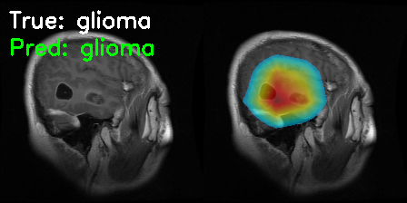
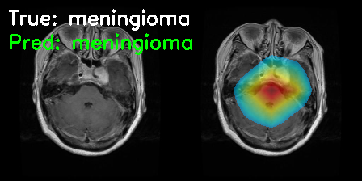
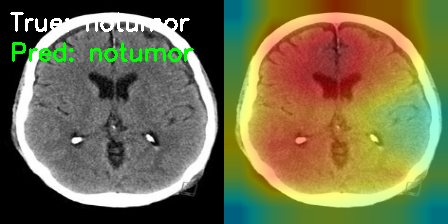

# Explainable Brain MRI: Clinical-Grade Tumor Classification with Visual XAI & LLM Verification

[](https://www.python.org/)
[](https://pytorch.org/)
[](LICENSE)
[](https://deepmind.google/technologies/gemini/)

> **Transparency in Neuro-Oncology**: A complete pipeline for classifying brain tumors (Glioma, Meningioma, Pituitary) that combines **Deep Learning Accuracy**, **Grad-CAM++ Visual Explanations**, and **Generative AI Clinical Reporting**.

---

## 🚀 Key Innovations

### 1. 👁️ Smart-Masking XAI
Unlike standard heatmaps that obscure the image, our **Grad-CAM++** implementation uses dynamic thresholding to highlight *only* the lesion while keeping the anatomy visible.
*   **Method**: `cv2.threshold` > 30% intensity + Alpha Blending.
*   **Result**: Clear visualization of tumor boundaries without "color fog."

### 2. 🤖 AI Radiologist (Gemini 1.5 Integration)
We simulate a dual-reader workflow by piping the MRI scan and ResNet prediction to **Google Gemini 1.5 Pro**.
*   **Visual Verification**: The LLM independently analyzes the image features.
*   **Hallucination Check**: If ResNet is wrong (e.g., predicting Tumor on a healthy scan), Gemini often flags the discrepancy.
*   **Automated Reporting**: Generates a structured clinical draft (Findings, Impression) instantly.

### 3. 💪 Quantitative Robustness
We moved beyond subjective "looks good" metrics.
*   **Faithfulness Score (0.37)**: Occlusion testing confirms the highlighted regions *cause* the prediction.
*   **Stability Score (0.98)**: Explanations remain consistent even with Gaussian noise and rotation.

---

## 🛠️ Tech Stack & Methodology

| Component | Technology | Role |
| :--- | :--- | :--- |
| **Backbone** | **ResNet-18** | Feature Extraction (Pre-trained on ImageNet) |
| **XAI Engine** | **Grad-CAM++** | High-fidelity localization of multiple lesion instances |
| **LLM Agent** | **Gemini 1.5 Flash** | Second-opinion and report generation |
| **Interface** | **Streamlit** | Interactive Clinical Dashboard |

---

## 💻 Interactive Application

The project includes a clinical dashboard for real-time inference.

### Running Locally
```bash
# 1. Install dependencies
pip install -r requirements.txt

# 2. Run the App
streamlit run src/app.py
```

### 🔐 API Key Configuration (Optional)
To use the Gemini features without pasting your key every time, create a secrets file:
*   Create `.streamlit/secrets.toml`
*   Add: `GOOGLE_API_KEY = "your_key_here"`
*   *Note: This file is git-ignored for safety.*

### 📂 Project Structure
```bash
Explainable-Brain-MRI/
├── data/                  # Dataset directory
├── src/
│   ├── app.py             # Streamlit Dashboard (+ Gemini Integration)
│   ├── gradcam.py         # XAI Engine (Grad-CAM++)
│   └── ...
├── med-gemma/             # [Experimental] Local Med-LLM playground
├── results/               # Generated Heatmaps
└── README.md
```


---

## 📊 Evaluation Results

### Visual Explanations
| **Glioma** | **Meningioma** | **No Tumor** |
| :---: | :---: | :---: |
|  |  |  |
*Note: The new Smart-Masking algorithm ensures the grey matter remains visible.*

### Quantitative Metrics
*   **Accuracy**: ~85% (ResNet Baseline)
*   **Faithfulness (Occlusion Drop)**: 0.37 avg
*   **Noise Stability**: 0.97 (Cosine Similarity)

---

## 🚨 Limitations & Safety
*   **Single-Slice 2D Analysis**: The current ResNet18 model looks at a single 2D slice. Tumors that are clear in 3D volume but subtle in one axial slice may be missed. This is why we created the **Dual-Verification System**.
*   **Contrast Media**: Our model is trained on T1-weighted images. Some tumors (e.g., small meningiomas) are isointense to brain tissue and only become visible with Gadolinium contrast, which this dataset does not consistently distinguish.

---


## � References & Inspiration
*   **Iftikhar et al. (2025)**: Importance of XAI in medical black-box models.
*   **Islam et al. (2025)**: Grad-CAM++ for improved lesion localization.

---

**Author**: Shek Lun Leung (Quantum AI)
**License**: MIT
